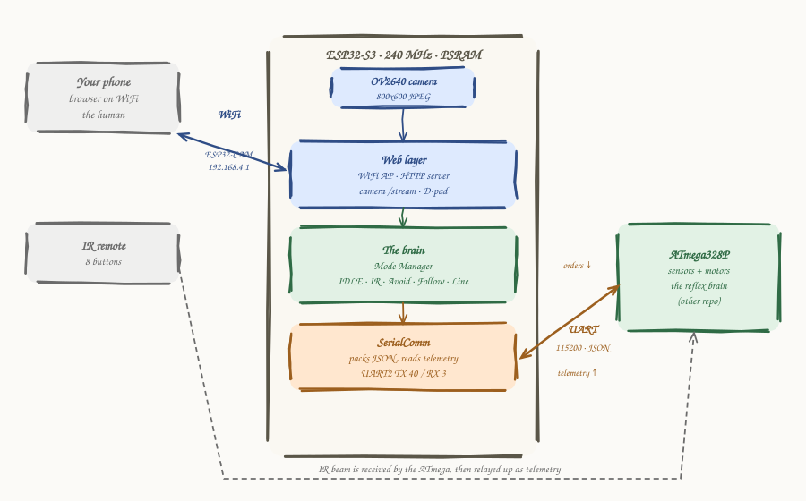
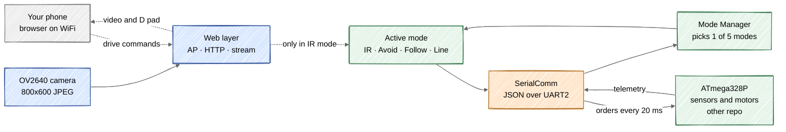

# ESP32-S3 Firmware — Elegoo Smart Car V4

[](https://opensource.org/licenses/MIT)
[](https://www.espressif.com/en/products/socs/esp32-s3)
[](https://platformio.org/)

Firmware for the car's **brain and its bridge to the world**: it holds the camera, serves the WiFi, decides what the car should do, and sends orders down a wire to the chip that actually moves the wheels. It touches no motor and reads no sensor directly — that is the other chip's job.

---

## What this is, and why

The [ELEGOO Smart Robot Car Kit V4.0 (With Camera)](https://eu.elegoo.com/products/elegoo-smart-robot-car-kit-v-4-0) ships with firmware that works out of the box. This project throws that firmware away and rebuilds the whole system "from scratch", as an outsider deliberately detaching from the vendor's ready-made answer in order to understand every layer of it.

**The quotes around "from scratch" are deliberate.** I am not writing a JPEG encoder or a TCP stack. `esp_camera` drives the OV2640 and hands me compressed frames, the Arduino `WebServer` parses HTTP, `WiFi` runs the access point, and `ArduinoJson` does the serialisation. A great deal of abstraction is being eaten on my behalf, and pretending otherwise would be dishonest.

What *is* built from scratch is everything above that line:

| Written here | Taken from a library |
|---|---|
| The architecture, and the choice of what runs on which chip | `esp_camera` — OV2640 driver and JPEG frames |
| The mode machine and its five behaviours | `WebServer` — HTTP parsing and routing |
| Every autonomous algorithm: obstacle avoidance, follow, line following | `WiFi` — the access point and TCP |
| The servo-sweep scanner and its timing model | `ArduinoJson` — parse and serialise |
| The wire protocol to the other chip, and the read → decide → write loop | Arduino core — `millis`, `Serial2`, GPIO |

The interesting engineering is not in serving an HTTP page. It is in deciding *when* to turn, *how* to sweep a sensor to find the gap, and what to say to the chip on the other end of the wire.

### This repo is one half of a pair

The car has **two microcontrollers**, and this repo is only the second one.

| Repo | Microcontroller | Role |
|---|---|---|
| [firmware-atmega328p](https://github.com/Adc-alt/elegoo-smartcar-firmware-atmega328p) | ATmega328P | **The actuator.** Owns every sensor and every motor. Executes orders. Reports state. Decides nothing |
| **this one** | ESP32-S3 | **The glue.** Bridges that chip to the outside world: camera, WiFi, the web page, and the actual decisions |

**Neither repo makes sense on its own.** The ATmega is a machine that obeys an interlocutor that is not there. **This repo is that interlocutor** — the one that gives the orders to hardware it cannot touch. The contract between them, the JSON protocol over UART, is documented in [Talking to the ATmega](#talking-to-the-atmega), and it is the single most important thing in either repository.

Both live under the [`elegoo-smart-car-robot`](https://github.com/topics/elegoo-smart-car-robot) topic, along with the computer-vision client and the hardware design files.

**Where to start:** read the [ATmega repo](https://github.com/Adc-alt/elegoo-smartcar-firmware-atmega328p) first. It is the layer where physics happens, and this side is much easier to follow once you know exactly what it is allowed to ask for.

### What this is not

It is not a product, and it is not a drop-in replacement for Elegoo's firmware — the official app will not talk to it. It is a learning vehicle in the literal sense. Things are half-built on purpose and some are outright broken; the honest ones are listed under [Gotchas](#gotchas) rather than quietly left for you to discover with a moving robot.

---

## How to read this README

Everything is explained **three times**, each time in more depth. Stop at the level you need and skip the rest.

| Level | Who it's for | What you get |
|---|---|---|
| 🟢 **Level 1 — The idea** | You have never touched a microcontroller | Analogies. No code |
| 🟡 **Level 2 — The mechanism** | You can program, hardware rings a bell | What actually happens, and why that way |
| 🔴 **Level 3 — The code** | You are going to touch the firmware | Files, functions, lines. *Collapsed by default* |

**Contents**

- [Two firmwares in one repo](#two-firmwares-in-one-repo) ← *read this first, it explains a real trap*
- [Division of labour](#division-of-labour)
- [Inside the ESP32](#inside-the-esp32)
- [The main loop](#the-main-loop)
- [The five modes](#the-five-modes) → [IDLE](#idle) · [IR](#ir) · [Obstacle avoidance](#obstacle-avoidance) · [Follow](#follow) · [Line following](#line-following)
- [The camera and the web page](#the-camera-and-the-web-page) ← *the bridge to the world*
- [Talking to the ATmega](#talking-to-the-atmega) ← *its own section; it is half the project*
- [Build and flash](#build-and-flash)
- [Gotchas](#gotchas)

---

## Two firmwares in one repo

Before anything else: this repository builds into **two different firmwares**, and their names are the opposite of what you would guess.

| PlatformIO environment | Source file | What it actually is |
|---|---|---|
| `esp32s3camlcd` | `src/main/main.cpp` | A **camera-only demo**: WiFi access point + a web page + a JPEG stream. No brain, no motors, no link to the ATmega |
| `esp32s3camlcd_test` | `src/test/main.cpp` | **The real firmware**: the full brain, the five modes, the UART link to the ATmega, *and* the web control on top |

And the trap:

```ini
[platformio]
default_envs = esp32s3camlcd_test
```

**The default build is the one called `_test`.** The file named `test` is the complete product; the file named `main` is the throwaway demo. When this README says "the firmware", it means [`src/test/main.cpp`](src/test/main.cpp). The rest of this document describes that build unless it says otherwise.

---

## Division of labour

> ### 🟢 Level 1 — The idea
>
> Keep thinking of the car as a person. The [ATmega repo](https://github.com/Adc-alt/elegoo-smartcar-firmware-atmega328p) is the **body**: the senses and the muscles and the reflexes. This repo is the **head**:
>
> | Job | Human equivalent | Who handles it |
> |---|---|---|
> | Eyes | The camera | **ESP32** — this repo |
> | Talking to the outside world | The mouth and ears | **ESP32** — WiFi and the web page |
> | "I am going to turn left now" | The decision | **ESP32** — the mode machine |
> | Moving the muscle that instant | Reflexes, the spinal cord | **ATmega** — the other repo |
>
> The ESP32 never touches a motor. It **decides**, then it **asks** the ATmega to do it.

> ### 🟡 Level 2 — The mechanism
>
> This is a **two-microcontroller architecture**, and it exists for one concrete reason: **real time and raw compute are enemies**.
>
> The ATmega328P is slow (16 MHz, 2 KB RAM) but *predictable*: no operating system, no radio, so it services the ultrasonic sensor on the exact millisecond it should, every time. The ESP32-S3 is the opposite: fast enough to compress video and run a WiFi stack, but its network interrupts fire at unpredictable moments — exactly the thing that ruins a microsecond-precise `pulseIn`.
>
> **The split:** the slow, reliable chip touches the hardware. The fast, unpredictable chip — this one — thinks, sees, and talks to the world. The two meet at a single serial cable.

---

## Inside the ESP32

A map of what lives on this chip and what it connects to. Blue is the outward-facing layer (camera + WiFi + web), green is the brain, orange is the serial link down to the ATmega:

<p align="center">
  
</p>

The same thing as a data-flow graph — telemetry comes **up** from the ATmega, a decision is made, orders go back **down**:



<details>
<summary>🔴 <b>Level 3 — The pins on this side</b></summary>

From [`include/elegoo_smartcar_lib.h`](include/elegoo_smartcar_lib.h). Two groups: the serial link to the ATmega, and the camera's parallel bus.

| Pin(s) | What is connected |
|---|---|
| 40 (TX) / 3 (RX) | **UART2 to the ATmega.** The whole conversation happens here |
| 2 | On-board LED — lit once the access point is up |
| 15 | Camera `XCLK` — the master clock fed to the sensor |
| 13 / 6 / 7 | Camera `PCLK` / `VSYNC` / `HREF` — pixel, frame and line sync |
| 4 / 5 | Camera `SIOD` / `SIOC` — the SCCB (I²C-like) bus that configures the sensor |
| 11 9 8 10 12 18 17 16 | Camera `D0`–`D7` — the 8-bit parallel pixel bus |

Note this is the **ESP32-S3** pin map, matching `board = esp32-s3-devkitc-1` in `platformio.ini`. The repo still carries older WROVER-era leftovers (`include/camera_pins.h`, `include/CameraWebServer_AP.h`, the old camera description) that the current build does **not** use.

</details>

---

## The main loop

> ### 🟢 Level 1 — The idea
>
> This chip runs the same simple rhythm as the ATmega, but from the other side of the conversation:
>
> **listen to the body → decide → tell the body what to do.**
>
> Ten to fifty times a second: read what the sensors reported, work out the next move, send the order back.

> ### 🟡 Level 2 — The mechanism
>
> It is the classic **read inputs → decide → write outputs** loop, and the pieces are:
>
> 1. **Read** — pull the latest telemetry line off the serial port (button, distance, line sensors, battery, motion, IR code) into an `InputData` struct.
> 2. **Decide** — hand that struct to the `ModeManager`. It picks the active mode and lets that mode fill in an `OutputData` struct (motor action, speed, servo angle, LED colour).
> 3. **Write** — every 20 ms, pack `OutputData` into JSON and send it down to the ATmega.
>
> The web server is serviced *inside* this loop too — but **only when the car is in IR mode** (more on that surprise under [Gotchas](#gotchas)).

<details>
<summary>🔴 <b>Level 3 — The real loop</b></summary>

From [`src/test/main.cpp`](src/test/main.cpp):

```cpp
void loop()
{
  wifiAp.loop();                                   // keep the access point alive

  // The web server only runs in IR mode, so the autonomous loops stay fast
  if (modeManager.getCurrentMode() == CarMode::IR_MODE)
    webHost.loop();

  // 1. READ — telemetry from the ATmega into InputData
  if (Serial2.available() > 0)
    if (comm.readJsonBySerial())                   // ~12 ms when a full line is waiting
      updateInputData();
  comm.checkTimeout();

  // 2. DECIDE — the active mode fills OutputData
  modeManager.updateStates(inputData, outputData);

  // web-command dead-man's switch (IR mode): 400 ms of silence -> freeStop
  if (modeManager.getCurrentMode() == CarMode::IR_MODE && webCommandActive &&
      millis() - lastWebCommandTime >= WEB_COMMAND_TIMEOUT_MS)
  { CarActions::freeStop(outputData); webCommandActive = false; }

  // 3. WRITE — orders back down to the ATmega, rate-limited
  if (millis() - comm.lastSendTime >= comm.SEND_INTERVAL)   // SEND_INTERVAL = 20 ms
  {
    comm.sendJson["ledColor"]   = outputData.ledColor;
    comm.sendJson["servoAngle"] = outputData.servoAngle;
    JsonObject motors = comm.sendJson["motors"].to<JsonObject>();
    motors["action"]  = outputData.action;
    motors["speed"]   = outputData.speed;
    comm.sendJsonBySerial();
    comm.lastSendTime = millis();
  }
}
```

`InputData` and `OutputData` (in [`lib/inputs/`](lib/inputs/) and [`lib/outputs/`](lib/outputs/)) are plain structs. They are the firmware's whole model of the world: what the ATmega last said, and what we want it to do next.

</details>

---

## The five modes

The brain is a **mode machine**. At any moment the car is in exactly one of five modes, and you cycle through them by **pressing the physical button** — which the ESP32 only learns about because the ATmega reports it in the telemetry.

> ### 🟢 Level 1 — The idea
>
> Press the button to change what the car is trying to do. Each press moves to the next behaviour, and the LED colour tells you which one you are in:
>
> | Press | Mode | LED | What the car does |
> |---|---|---|---|
> | 0 | **IDLE** | 🟡 yellow | Nothing. Sits still |
> | 1 | **IR** | 🔵 blue | Obeys the remote (or the web D-pad) |
> | 2 | **Obstacle avoidance** | 🟢 green | Drives forward, steers around whatever it sees |
> | 3 | **Follow** | 🟣 purple | Finds an object and chases it |
> | 4 | **Line following** | 🟢 green | Follows a black line on the floor |
>
> Press again after line following and you are back to IDLE.

> ### 🟡 Level 2 — The mechanism
>
> Every mode implements the same tiny interface — `startMode()`, `update()`, `stopMode()` — and the `ModeManager` just runs whichever one is active. Switching modes is **edge-triggered**: it fires once on the button's press, not continuously while you hold it. Each mode is a persistent object, so it keeps its own state machine between loop iterations.
>
> This is textbook polymorphism, and it means adding a sixth behaviour is one new class plus one line in the manager. The full walk-through with a worked example lives in [`FLUJO_EXPLICADO.md`](FLUJO_EXPLICADO.md).

<details>
<summary>🔴 <b>Level 3 — the Mode interface and the manager</b></summary>

Every behaviour derives from `Mode` ([`lib/mode_manager/mode_manager.h`](lib/mode_manager/mode_manager.h)):

```cpp
class Mode {
public:
  virtual void startMode() {}
  virtual void stopMode(OutputData& outputData) {}
  virtual bool update(const InputData& inputData, OutputData& outputData) = 0;
};
```

`ModeManager::updateStates()` does two things each call: detect the button's rising edge to advance `modeCounter` (mod 5) and hand over via `startMode()`/`stopMode()`, then run the active mode's `update()`:

```cpp
bool rising = inputData.swPressed && !swPressedPrevious;
if (rising) { modeCounter = (modeCounter + 1) % 5; /* stop old, start new, set LED */ }
swPressedPrevious = inputData.swPressed;

switch (currentMode) {
  case CarMode::IR_MODE:                getIrModeInstance().update(inputData, outputData); break;
  case CarMode::OBSTACLE_AVOIDANCE_MODE:getObstacleAvoidanceModeInstance().update(inputData, outputData); break;
  case CarMode::FOLLOW_MODE:            getFollowModeInstance().update(inputData, outputData); break;
  case CarMode::LINE_FOLLOWING_MODE:    getLineFollowingModeInstance().update(inputData, outputData); break;
  case CarMode::IDLE: default:          CarActions::freeStop(outputData); CarActions::setServoAngle(outputData, 90); break;
}
```

Each `getXInstance()` returns a `static` local — created once, state preserved across calls. No `new`, no heap.

**Nobody in a mode writes to `outputData.action` directly.** They all go through `CarActions` ([`lib/car_actions/`](lib/car_actions/)) — `forward()`, `turnLeft()`, `freeStop()`, `setServoAngle()`, `setLedColor()`. It is the single choke-point that produces the words the ATmega understands, and it logs only on change to avoid flooding the serial port.

</details>

### IDLE

> **🟢 Level 1** — The resting state. The car stops, the servo centres, the LED is yellow. This is where you start and where you land after cycling through everything.

> **🟡 Level 2** — `freeStop` (coast, not brake) plus servo to 90°, re-sent every loop so the ATmega can never drift into motion on its own.

### IR

> **🟢 Level 1** — Drive it yourself. Point the remote and the car goes forward, back, left, right, or aims its sensor. **This is also the only mode where the phone D-pad works** and the only mode where the camera page responds.

> **🟡 Level 2** — The IR receiver is physically wired to the *ATmega*, which forwards the raw remote code up in the telemetry as `irRaw`. This mode maps each code to a `CarActions` call. If no fresh code arrives for 400 ms, it `freeStop`s — so the car moves while you hold a button and stops when you let go, without the remote needing to send a "stop".

<details>
<summary>🔴 <b>Level 3 — the IR codes are placeholders</b></summary>

[`lib/ir_mode/ir_mode.cpp`](lib/ir_mode/ir_mode.cpp) matches **hard-coded raw NEC values**:

```cpp
if (irRaw == 3108437760)      CarActions::forward(outputData, 80);
else if (irRaw == 3927310080) CarActions::backward(outputData, 80);
else if (irRaw == 3141861120) CarActions::turnLeft(outputData, 80);
// ... left/right/stop/servo ...
else                          CarActions::freeStop(outputData);   // unknown code
```

These numbers are **placeholders**, flagged with a `TODO` in the code. Every remote reports different raw codes; until you capture your own (print `irRaw` from the telemetry and read them off), IR mode will only ever hit the `else` and stop. That is the first thing to fix if you want to actually drive it.

</details>

### Obstacle avoidance

> **🟢 Level 1** — The car drives forward on its own. When something gets too close (under 20 cm) it stops, **sweeps its sensor left–centre–right to look around**, then turns toward whichever side has the most room and carries on. If it is boxed in on all sides, it backs up and escapes.

> **🟡 Level 2** — A three-state machine: `MOVING_FORWARD` → `EVALUATING` → `ESCAPING`. The looking-around is delegated to a shared helper, `SensorServo`, which owns the servo sweep and remembers the distance measured at each angle. The mode only decides *what to do* with those three numbers.

<details>
<summary>🔴 <b>Level 3 — the state machine and the scanner</b></summary>

[`lib/obstacle_avoidance/obstacle_avoidance.cpp`](lib/obstacle_avoidance/obstacle_avoidance.cpp):

- **`MOVING_FORWARD`** — drive at `SPEED` (30); if `distance` drops below `OBSTACLE_THRESHOLD_CM` (20), stop and go to `EVALUATING`.
- **`EVALUATING`** — ask `SensorServo::startScanning()`; wait until the sweep and the servo's return-to-centre are both finished, then `decideDirection()`.
- **`ESCAPING`** — a sub-phase sequence (`BACKUP` → `TURN_LEFT`/`TURN_RIGHT` → `RESUME`) driven by timers (`BACKUP_DURATION_MS`, `TURN_DURATION_MS`).

`decideDirection()` compares the left/centre/right distances: if all three are under `MIN_FREE_DISTANCE_CM`, it backs up and does the full zig-zag escape; otherwise it turns toward the larger of left/right.

The scanner ([`lib/sensor_servo/`](lib/sensor_servo/)) hides one physical truth worth knowing: **the servo angles are mirrored**. `MIN_ANGLE` (20°) points physically **right**, `MAX_ANGLE` (160°) points **left**. It also models how long a servo takes to move, `t ≈ 150 + 27·√Δθ` ms — a small measured formula rather than a blind `delay`; the derivation is in [`lib/sensor_servo/README.md`](lib/sensor_servo/README.md).

</details>

### Follow

> **🟢 Level 1** — The opposite of avoidance: instead of dodging the nearest object, the car **hunts for one and chases it**. It sweeps to find something in range, turns to face it, drives up to it, and stops just before touching. Lose the object and it goes back to searching.

> **🟡 Level 2** — States: `SEARCHING` → `TURNING_TO_OBJECT` → `MOVING_FORWARD`. It reuses the same `SensorServo` scanner, but in *search* mode: the servo sweeps until the ultrasonic reading falls inside the threshold, records the angle, and the car rotates by an amount proportional to how far off-centre that angle was.

<details>
<summary>🔴 <b>Level 3 — turn duration from angle</b></summary>

[`lib/follow_mode/follow_mode.cpp`](lib/follow_mode/follow_mode.cpp) turns the found angle into a timed rotation:

```cpp
int angleFromCentre = abs(foundObjectAngle - SensorServo::FRONT_ANGLE);   // 0..70
turnDuration = (unsigned long)(400 * (angleFromCentre / 70.0) * 0.85);
turnDuration = constrain(turnDuration, 200, 1200);                        // ms
```

In `MOVING_FORWARD` it watches the distance: past `OBJECT_LOST_DISTANCE_CM` it declares the object lost and re-searches; under `OBJECT_TOO_CLOSE_CM` it stops; in between it keeps closing in. Because `MIN_ANGLE` is physically right, `turnCarToAngle()` maps *small* servo angles to a **right** turn and *large* ones to a **left** turn — the same mirror the scanner deals with.

</details>

### Line following

> **🟢 Level 1** — The car follows a black line painted on the floor, using the three downward-looking sensors on the ATmega. Line under the middle sensor → drive straight. Line drifting to one side → nudge that way. Line lost entirely → a quick recovery jerk toward the side it last saw it.

> **🟡 Level 2** — The three sensors give a 3-bit pattern (left, middle, right). `100`/`110` means "line is left, steer left"; `001`/`011` means "steer right"; `010`/`111` means "straight"; `000` means "lost". It **remembers the last side it saw the line** so that when it goes to `000` it jerks back the right way instead of guessing.

<details>
<summary>🔴 <b>Level 3 — pattern to LineState, and pulsed turns</b></summary>

[`lib/line_following/line_following.cpp`](lib/line_following/line_following.cpp) thresholds each analog reading, then classifies:

```cpp
bool L = inputData.lineSensorLeft   > LINE_THRESHOLD;
bool M = inputData.lineSensorMiddle > LINE_THRESHOLD;
bool R = inputData.lineSensorRight  > LINE_THRESHOLD;
// 100 -> LEFT   010 -> CENTER   001 -> RIGHT
// 110 -> CENTER_LEFT   011 -> CENTER_RIGHT   111 -> CENTER
// 000 -> LOST_LEFT / LOST_RIGHT / LOST  (chosen from the remembered last side)
```

Turns are sent as **timed pulses**, not held continuously — one command per state change, with `STRONG_TURN_PULSE_MS` / `SMOOTH_TURN_PULSE_MS` windows — deliberately, so the author could watch the ATmega's real response one pulse at a time while tuning. The `LOST_*` recovery fires exactly one pulse (`lostRecoveryConsumed` guards it) and then idles rather than spinning forever. A design note on why this matters — the shared serial buffer can be flooded by chatty modes — is in [`lib/line_following/README.md`](lib/line_following/README.md).

</details>

---

## The camera and the web page

This is the ESP32's reason to exist as a separate chip: it is the eyes and the mouth. It deserves its own section.

> ### 🟢 Level 1 — The idea
>
> The ESP32 makes its **own WiFi network**. You connect your phone to it — no router, no internet — open a web page it hosts, and you get a camera picture and a set of drive buttons. The whole "remote control with a video feed" experience is served straight off this chip.

> ### 🟡 Level 2 — The mechanism
>
> Three pieces cooperate:
>
> - **`WiFiAP`** brings up an access point named **`ESP32-CAM`** (password `12345678`) at a fixed address **`192.168.4.1`**. No router involved.
> - **`WebServerHost`** owns the HTTP server and its routes: `GET /` (the control page), `GET /ping` (a status JSON), `POST /command` (a drive command). It hands a raw command to the brain through a callback.
> - **`Streaming`** boots the OV2640 and adds `GET /stream`, which returns **one JPEG frame per request** — SVGA (800×600), quality 12.
>
> A button press on the page does a `fetch('/command', ...)` with a tiny JSON body like `{"action":"forward","speed":70}`. The server hands `(action, speed)` to the brain — which, remember, only acts on it in IR mode.

<details>
<summary>🔴 <b>Level 3 — routes, the command path, and the camera config</b></summary>

**Routes** — registered in [`lib/web/web_server_host/`](lib/web/web_server_host/) and [`lib/web/streaming/`](lib/web/streaming/):

| Route | Handler | Returns |
|---|---|---|
| `GET /` | `handle_root` | The HTML control page (a 5-button D-pad) |
| `GET /ping` | `handle_ping` | `{"status":"ok","clients":N,"wifi_connected":…}` |
| `POST /command` | `handle_command` | Parses `{action, speed}`, fires the callback, replies `{"ok":true}` |
| `GET /stream` | `handle_stream` | A single JPEG frame |

**The command path** ([`lib/web/command_api/`](lib/web/command_api/)) is the web mirror of the IR mapping — it clamps `speed` to 0–255 and translates the action string to a `CarActions` call:

```cpp
if      (strcmp(action, "forward")  == 0) CarActions::forward(outputData, speed);
else if (strcmp(action, "backward") == 0) CarActions::backward(outputData, speed);
else if (strcmp(action, "stop")     == 0) CarActions::forceStop(outputData);
// left / right ...  unknown action: ignored
```

**The camera** ([`lib/web/streaming/streaming.cpp`](lib/web/streaming/streaming.cpp)) is configured for `PIXFORMAT_JPEG`, `FRAMESIZE_SVGA`, `jpeg_quality = 12`, `fb_count = 1`, and flipped vertically (`set_vflip`). `handle_stream()` grabs one frame buffer, sends it, and returns it — deliberately one-frame-per-request so the server stays free to answer `POST /command` between frames.

</details>

---

## Talking to the ATmega

This is the contract, and it is the **exact mirror image** of the [ATmega's protocol section](https://github.com/Adc-alt/elegoo-smartcar-firmware-atmega328p#communication). What the ATmega *sends*, this chip *receives*. What this chip *sends*, the ATmega *obeys*.

> ### 🟢 Level 1 — The idea
>
> The two chips talk over two wires, in **plain readable text**. Plug in a USB cable, open a serial monitor, and you can see the whole conversation — the sensor reports flowing up, the orders flowing down.

> ### 🟡 Level 2 — The mechanism
>
> **The channel:** UART2 (`Serial2`), 115200 baud, on pins TX 40 / RX 3.
>
> **The format:** JSON, one message per line, terminated by `\n` — *JSON Lines*. A newline is how each side knows where one message ends and the next begins.
>
> **Two directions, two rates:** the ATmega streams telemetry up continuously; this chip sends orders down every 20 ms (`SEND_INTERVAL`). The read side is non-blocking — it only parses a line when a whole one is already sitting in the buffer.

### What the ESP32 SENDS — the orders (every 20 ms)

```json
{"servoAngle":90,"ledColor":"GREEN","motors":{"action":"forward","speed":60}}
```

| Field | What it is |
|---|---|
| `motors.action` | `forward`, `backward`, `turnLeft`, `turnRight`, `forceStop`, `freeStop` |
| `motors.speed` | 0–255 (the brain works in 0–100; the ATmega maps it onto real PWM) |
| `servoAngle` | 0–200°, aims the ultrasonic sensor |
| `ledColor` | `RED`, `GREEN`, `BLUE`, `PURPLE`, `CYAN`, `YELLOW`, `SALMON`, `WHITE`, `BLACK` |

### What the ESP32 RECEIVES — the telemetry

The full sensor picture, unpacked into `InputData` every line:

| Field | What it is |
|---|---|
| `swPressed` / `swCount` | Button state and message counter — the button is how you cycle modes |
| `hcsr04DistanceCm` | Distance to the obstacle, cm — the input to avoidance and follow |
| `lineSensorLeft` / `Middle` / `Right` | Raw line-sensor readings — the input to line following |
| `batVoltage` | Volts ×100 (`740` = 7.40 V) |
| `mpuAccelX/Y/Z`, `mpuGyroX/Y/Z` | Motion, ×100 |
| `irRaw` | Raw remote code — the input to IR mode |

<details>
<summary>🔴 <b>Level 3 — SerialComm, and testing without an ATmega</b></summary>

[`lib/serial_comm/`](lib/serial_comm/) holds two `JsonDocument`s (send and receive) and four methods: `initializeJsons()`, `sendJsonBySerial()`, `readJsonBySerial()`, `checkTimeout()`. Reading is a single non-blocking line pull:

```cpp
bool SerialComm::readJsonBySerial() {
  if (Serial2.available() <= 0) return false;
  String jsonString = Serial2.readStringUntil('\n');
  jsonString.trim();
  if (jsonString.length() == 0) return false;
  return !deserializeJson(receiveJson, jsonString);   // updates lastReceiveTime on success
}
```

You can drive this chip **without the ATmega attached**: wire a USB-serial adapter to pins 40/3, and feed it telemetry lines by hand to watch the brain react:

```bash
# send a fake telemetry frame, then read what the ESP32 orders back
printf '{"swPressed":false,"hcsr04DistanceCm":15,"irRaw":0}\n' > /dev/ttyUSB0
```

Drop the distance below 20 cm while in obstacle mode and you will see the outgoing `motors.action` change from `forward` to a stop-and-scan — no wheels required.

</details>

---

## Build and flash

You need [PlatformIO](https://platformio.org/) — the VS Code extension, or `pip install platformio`.

```bash
pio run -e esp32s3camlcd_test              # build the real firmware (the default)
pio run -e esp32s3camlcd_test -t upload    # build and flash over USB
pio device monitor -b 115200               # watch the debug log

pio run -e esp32s3camlcd -t upload         # ...or flash the camera-only demo instead
```

Then connect your phone to the WiFi network **`ESP32-CAM`** (password `12345678`) and open **`http://192.168.4.1`**.

<details>
<summary>🔴 <b>Level 3 — the board and the build filter</b></summary>

Target board: `esp32-s3-devkitc-1`, 240 MHz, PSRAM enabled (`qio_opi`), `huge_app` partitions — the JPEG frame buffers need the extra RAM and the binary needs the extra Flash. Arduino-ESP32 core is pinned to `2.0.14`.

Which `.cpp` files compile is chosen per environment by `build_src_filter` in [`platformio.ini`](platformio.ini): the `_test` env pulls in every `lib/` module plus `src/test/main.cpp`; the plain env pulls in only the camera/web trio plus `src/main/main.cpp`. That is the mechanism behind [Two firmwares in one repo](#two-firmwares-in-one-repo).

</details>

---

## Repository layout

```
src/test/main.cpp   <- THE REAL FIRMWARE (the default build). If you read one file, read this
src/main/main.cpp   <- the camera-only demo
include/            <- elegoo_smartcar_lib.h: pins for the UART and the camera bus
lib/                <- one folder per responsibility (see below)
FLUJO_EXPLICADO.md  <- a step-by-step walk-through of the mode machine
```

The modules under `lib/`:

| Module | Responsibility |
|---|---|
| `serial_comm` | The JSON-over-UART link to the ATmega |
| `mode_manager` | Holds the active mode, cycles on the button, runs its `update()` |
| `ir_mode` · `obstacle_avoidance` · `follow_mode` · `line_following` | The four active behaviours |
| `sensor_servo` | Shared servo-sweep scanner used by avoidance and follow |
| `car_actions` | The only place that turns a decision into ATmega vocabulary |
| `inputs` · `outputs` | The two structs that model the world |
| `web/wifi_ap_manager` | Brings up the `ESP32-CAM` access point |
| `web/web_server_host` | The HTTP server and its routes |
| `web/streaming` | The OV2640 camera and `/stream` |
| `web/command_api` | Translates a web command into a `CarActions` call |

---

## Gotchas

Real quirks of this firmware. If something "doesn't work", look here before reflashing.

- **The default build is the one named `_test`.** `src/test/main.cpp` is the complete firmware; `src/main/main.cpp` is a stripped camera demo. The names are backwards. See [Two firmwares in one repo](#two-firmwares-in-one-repo).
- **The camera and web page only respond in IR mode.** `webHost.loop()` is called *only* when the mode is IR, to keep the autonomous loops fast. In obstacle / follow / line modes the page and `/stream` stop answering and the browser hangs. Switch to IR (blue LED) before expecting the phone to do anything.
- **The web D-pad also only drives in IR mode.** `POST /command` is honoured only when the active mode is IR; in any other mode the brain ignores it.
- **The control page does not show the video.** `handle_root()` serves a D-pad but no ``. To see the camera, open `http://192.168.4.1/stream` directly — and that is a **single still frame per request**, not a live feed. (`streaming.h` declares a 10 FPS `frameInterval`, but nothing uses it.)
- **The IR codes are placeholders.** `ir_mode.cpp` matches hard-coded raw values with a `TODO`. Until you replace them with your own remote's codes, IR mode only ever hits the "unknown → stop" branch.
- **The 2-second timeout does nothing.** `checkTimeout()` raises `timeoutActive`, which no code reads. If the ATmega's telemetry drops, the ESP32 keeps re-sending the last order — the car does not stop itself. (The ATmega side has the exact same dead flag.)
- **No STA WiFi is ever joined.** The radio is in `WIFI_AP_STA` and a 30-second reconnect check runs, but no station credentials are ever set, so that branch is dead. It is an access point and nothing else.
- **Two comments lie about numbers.** `SEND_INTERVAL` is 20 ms (the comment says 500 ms); the camera `XCLK` is 20 MHz (the comment says 10 MHz). The code is right, the comments are stale.

---

## The rest of the project

| Repo | What it does |
|---|---|
| [firmware-atmega328p](https://github.com/Adc-alt/elegoo-smartcar-firmware-atmega328p) | Sensors and actuators — the reflex brain |
| **firmware-esp32-s3** — you are here | Camera, WiFi and the decisions |
| [elegoo-smartcar-vision](https://github.com/Adc-alt/elegoo-smartcar-vision) | Computer vision in Python |
| [hardware-smart-car](https://github.com/Adc-alt/hardware-smart-car) | PCBs and manufacturing |

Base hardware: [ELEGOO Smart Robot Car Kit V4.0](https://eu.elegoo.com/products/elegoo-smart-robot-car-kit-v-4-0).

## License

MIT.
